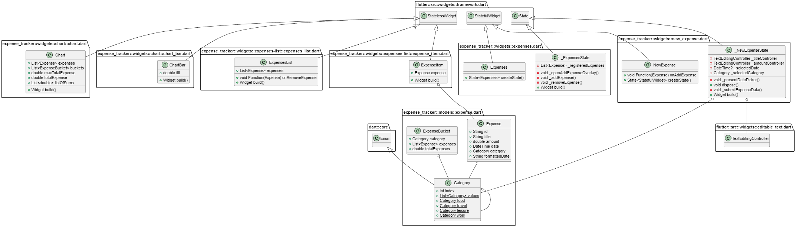

# expense_tracker

In this project I created a simple expense tracking app for the Mobile Applications course at NTNU. Included below is further documentation required for this assignment.

## User Story

- As a user I'd like to get an overview over my spending and how my money is divided between various categories
- As a user I'd like to be able to create a new expense and save it for later viewing or book keeping
- As a user I'd like a way to delete expenses that no longer interest me
- As a user I'd like to be able to restore a deleted expense in case it was deleted by mistake
- As a user I'd like to be able to see how much money I have spent so far
- As a user I'd like to see the difference in spending between the categories to be visualized. 

## App Architecture

### Main page

- App bar: Visible at the top of the page it provides a way for the user to access the new expense page
- Chart bar: Visible under the app bar, it gathers all the charts and displays them in a row for easy comparison
- Expense list: Provides a user with an overview of their expenses in the form of a list which is interactable and scrollable
- Expense item: Displays the various information about each individual expense item and allows the user to swipe left on them in order to delete them from the list
- Total spending: Allows the users to see the total amount of money they have spent across all the expenses - **My Extra Feature**
- Category spending: Visible under each of the chart bars is an amount of money that the user has spent on that specific category - **My Extra Feature**

### New expense page

- Title input box: Allows the user to input a String as the title for their expense
- Amount input box: Allows the user to input a double value as the amount of money for their expense
- Date picker button: Allows the user to pick a date from the calendar, that date being no farther in the future than the current day and no farther in the past than 1 year ago
- Category picker: Allows the user to pick the category which the expense falls under

## File and Folder Structure

main.dart file is the starting point of the application. The main method calls flutters runApp function in order to display the contents of the various widgets on the screen.  
The application is composed of 2 main folders. Those two are the models folder and the widgets folder.    
The models folder houses the expense.dart file which contains the Expense and the ExpenseBucket class which are used in order to accept the data from the user and output it to various list in order to streamline the process of rendering it to charts.  
It also houses the expenses.dart file which is responsible for rendering the main page of the application as well as handling the logic behind adding and removing expenses as well as opening the snackbar, granting the user access to the new expenses screen.    
The widget folder contains 2 subcategories:  
The chart folder houses chart_bar.dart and the chart.dart file. The chart_bar.dart file is responsible for visualizing individual bars based on logic contained withing the chart.dart file so that it may be grouped and displayed by the chart.dart file.  
The expenses-list folder houses expense_items.dart file which is responsible for rendering individual expenses as list elements, and the expense_list.dart file which is responsible for gathering these individual list items and rendering them as one big list which the user can scroll through. 

## Class diagram

## Peer Review

I have included my findings on how I will be able to learn from my peer review partner in a separate .pdf file which I have attached to the blackboard delivery.
